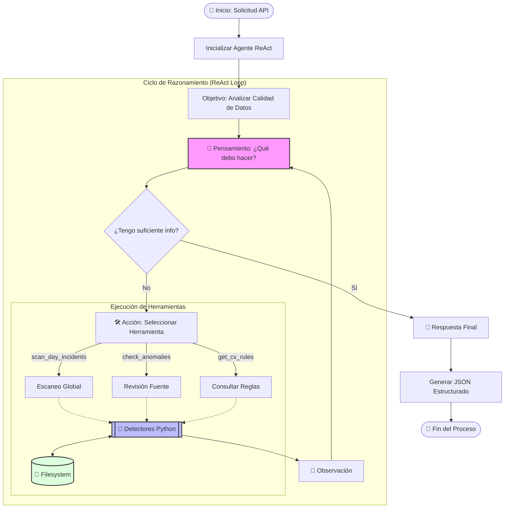

# Simetrik Incident Detection Agent 🕵️‍♂️📊

## Visión General del Negocio

El **Simetrik Incident Detection Agent** es una solución automatizada de aseguramiento de calidad de datos (Data Quality Assurance) diseñada para monitorear, detectar y reportar anomalías en los procesos de ingesta de datos financieros y operativos.

Su objetivo principal es **reducir el tiempo de detección de incidentes** (MTTD) y eliminar la necesidad de revisión manual de miles de archivos diarios. El agente actúa como un analista experto que trabaja 24/7, validando que la información recibida cumpla con los patrones históricos y las reglas de negocio esperadas.

### Valor Agregado
- **Proactividad:** Detecta archivos faltantes o vacíos antes de que afecten los procesos de conciliación.
- **Precisión Híbrida:** Combina reglas determinísticas estrictas (código) con razonamiento contextual (IA/LLM) para reducir falsos positivos.
- **Transparencia:** Genera reportes detallados con evidencia, recomendaciones y costos de ejecución.

---

## Arquitectura e Infraestructura

El sistema opera bajo una arquitectura modular basada en microservicios (vía API REST) y el patrón de diseño **ReAct (Reasoning + Acting)** para su modo agéntico.

### Flujo de Razonamiento del Agente

Este diagrama detalla cómo el agente "piensa" y utiliza las herramientas deterministas para llegar a una conclusión.



---

## Componentes Clave

### 1. El Concepto de "CV" (Curriculum Vitae de la Fuente)
Cada fuente de datos (ej. un banco, un procesador de pagos) tiene un "CV". Este es un archivo de configuración inteligente que define la "personalidad" y comportamiento esperado de la fuente:
- **Horarios de carga:** ¿A qué hora deben llegar los archivos?
- **Volumen esperado:** ¿Cuántos registros son normales un lunes vs. un domingo?
- **Entidades:** ¿Qué sub-entidades (ej. "Uber", "Rappi") deben estar presentes?

### 2. Detectores Especializados
El agente cuenta con "sentidos" específicos para diferentes tipos de problemas:
- **MissingFileDetector:** Alerta si no llegan archivos esperados (Criticidad: **URGENTE**).
- **UnexpectedVolumeVariationDetector:** Alerta si el volumen de filas sube o baja drásticamente (Criticidad: **NEEDS_ATTENTION**).
- **UnexpectedEmptyFileDetector:** Alerta si llegan archivos vacíos cuando no deberían.
- **LateUploadDetector:** Alerta si los archivos llegan fuera de la ventana de tiempo.
- **DuplicatedFailedFileDetector:** Detecta duplicados o cargas fallidas.

### 3. Modo Agéntico (ReAct)
En este modo, el sistema no solo sigue reglas, sino que **piensa**:
1.  **Observa:** Escanea el estado del día.
2.  **Razona:** "Veo que faltan archivos de la fuente X, pero es feriado, voy a verificar el calendario".
3.  **Actúa:** Ejecuta herramientas para profundizar en el análisis.
4.  **Concluye:** Genera un resumen ejecutivo en lenguaje natural explicando la situación.

---

## Lógica de Negocio y Clasificación

El agente clasifica el estado de cada fuente basándose en el "Peor Caso Encontrado":

| Estado | Descripción | Acción Recomendada |
| :--- | :--- | :--- |
| 🔴 **URGENT** | Incidente crítico que detiene la operación (ej. Faltan archivos, Archivos vacíos). | **Intervención Inmediata:** Re-procesar o contactar al proveedor. |
| 🟡 **NEEDS_ATTENTION** | Anomalía estadística (ej. Volumen bajo, Llegada tardía). No detiene el proceso pero indica riesgo. | **Revisión:** Validar si es un comportamiento de mercado o error técnico. |
| 🟢 **ALL_GOOD** | Todos los archivos llegaron en tiempo y forma según su CV. | Ninguna. |

---

## Flujo de Trabajo Típico

1.  **Trigger:** El sistema de orquestación invoca la API del agente (`POST /analyze`) para una fecha específica (ej. `2025-09-09`).
2.  **Carga de Contexto:** El agente lee los metadatos de los archivos recibidos ese día y carga los CVs de las fuentes activas.
3.  **Análisis:**
    *   Calcula estadísticas (Total de filas, Archivos procesados).
    *   Ejecuta los detectores contra las reglas del CV.
4.  **Consolidación:** Agrupa los incidentes por fuente y determina la severidad global.
5.  **Respuesta:** Devuelve un JSON estructurado con:
    *   Resumen ejecutivo.
    *   Lista detallada de incidentes.
    *   Estadísticas de consumo (Tokens/Costo).

## Stack Tecnológico

- **Lenguaje:** Python 3.12
- **API Framework:** FastAPI
- **LLM Integration:** OpenAI (GPT-4o / GPT-4o-mini)
- **Arquitectura:** Modular / Clean Architecture
- **Despliegue:** Docker & Docker Compose

## Ejecución con Docker

Para levantar el agente en un entorno aislado:

1.  **Configurar API Key:**
    Crea un archivo `.env` en la raíz del proyecto (o usa el que ya existe) y define tu clave:
    ```bash
    OPENAI_API_KEY=sk-proj-...
    ```

2.  **Levantar Servicios:**
    ```bash
    docker-compose up --build
    ```

3.  **Probar:**
    El agente estará disponible en `http://localhost:8005/analyze`.
