# Simetrik Incident Detection Agent 🕵️‍♂️📊

## Business Overview

The **Simetrik Incident Detection Agent** is an automated Data Quality Assurance solution designed to monitor, detect, and report anomalies in financial and operational data ingestion processes.

Its primary objective is to **reduce the Mean Time To Detect (MTTD)** incidents and eliminate the need for manual review of thousands of daily files. The agent acts as an expert analyst working 24/7, validating that received information complies with historical patterns and expected business rules.

### Value Proposition
- **Proactivity:** Detects missing or empty files before they affect reconciliation processes.
- **Hybrid Precision:** Combines strict deterministic rules (code) with contextual reasoning (AI/LLM) to reduce false positives.
- **Transparency:** Generates detailed reports with evidence, recommendations, and execution costs.

---

## Architecture & Infrastructure

The system operates under a modular microservices-based architecture (via REST API) and uses the **ReAct (Reasoning + Acting)** design pattern for its agentic mode.

### Agent Reasoning Flow

This diagram details how the agent "thinks" and uses deterministic tools to reach a conclusion.

```mermaid
graph TD
    Start([🚀 Start: API Request]) --> Init[Initialize ReAct Agent]
    Init --> Goal[Goal: Analyze Data Quality]

    subgraph Loop ["Reasoning Cycle (ReAct Loop)"]
        Goal --> Thought[🧠 Thought: What should I do?]
        Thought --> Decision{Enough info?}
        
        Decision -- No --> Action[🛠️ Action: Select Tool]
        
        subgraph Tools ["Tool Execution"]
            Action -- scan_day_incidents --> T1[Global Scan]
            Action -- check_anomalies --> T2[Source Check]
            Action -- get_cv_rules --> T3[Get Rules]
            
            T1 -.-> PyCode[[🐍 Python Detectors]]
            T2 -.-> PyCode
            T3 -.-> PyCode
            PyCode <--> DB[(📂 Filesystem)]
        end
        
        PyCode --> Obs[👀 Observation]
        Obs --> Thought
    end
    
    Decision -- Yes --> Final[📝 Final Answer]
    Final --> Report[Generate Structured JSON]
    Report --> End([🏁 End Process])

    style Thought fill:#f9f,stroke:#333,stroke-width:2px
    style PyCode fill:#bbf,stroke:#333,stroke-width:2px
    style DB fill:#dfd,stroke:#333,stroke-width:2px
```



---

## Key Components

### 1. The "CV" Concept (Source Curriculum Vitae)
Each data source (e.g., a bank, a payment processor) has a "CV". This is a smart configuration file that defines the "personality" and expected behavior of the source:
- **Upload Schedules:** What time should files arrive?
- **Expected Volume:** How many records are normal on a Monday vs. a Sunday?
- **Entities:** Which sub-entities (e.g., "Uber", "Rappi") must be present?

### 2. Specialized Detectors
The agent has specific "senses" for different types of problems:
- **MissingFileDetector:** Alerts if expected files do not arrive (Criticality: **URGENT**).
- **UnexpectedVolumeVariationDetector:** Alerts if row volume drops or spikes drastically (Criticality: **NEEDS_ATTENTION**).
- **UnexpectedEmptyFileDetector:** Alerts if empty files arrive when they shouldn't.
- **LateUploadDetector:** Alerts if files arrive outside the time window.
- **DuplicatedFailedFileDetector:** Detects duplicates or failed uploads.

### 3. Agentic Mode (ReAct)
In this mode, the system doesn't just follow rules, it **thinks**:
1.  **Observes:** Scans the day's status.
2.  **Reasons:** "I see missing files for source X, but it's a holiday, let me check the calendar."
3.  **Acts:** Executes tools to deepen the analysis.
4.  **Concludes:** Generates an executive summary in natural language explaining the situation.

---

## Business Logic & Classification

The agent classifies the status of each source based on the "Worst Case Found":

| Status | Description | Recommended Action |
| :--- | :--- | :--- |
| 🔴 **URGENT** | Critical incident stopping operation (e.g., Missing files, Empty files). | **Immediate Intervention:** Re-process or contact provider. |
| 🟡 **NEEDS_ATTENTION** | Statistical anomaly (e.g., Low volume, Late arrival). Does not stop process but indicates risk. | **Review:** Validate if it's market behavior or technical error. |
| 🟢 **ALL_GOOD** | All files arrived on time and form according to their CV. | None. |

---

## Typical Workflow

1.  **Trigger:** The orchestration system invokes the Agent API (`POST /analyze`) for a specific date (e.g., `2025-09-09`).
2.  **Context Loading:** The agent reads metadata of received files for that day and loads active source CVs.
3.  **Analysis:**
    *   Calculates statistics (Total rows, Processed files).
    *   Executes detectors against CV rules.
4.  **Consolidation:** Groups incidents by source and determines global severity.
5.  **Response:** Returns a structured JSON with:
    *   Executive summary.
    *   Detailed list of incidents.
    *   Consumption statistics (Tokens/Cost).

## Tech Stack

- **Language:** Python 3.12
- **API Framework:** FastAPI
- **LLM Integration:** OpenAI (GPT-4o / GPT-4o-mini)
- **Architecture:** Modular / Clean Architecture
- **Deployment:** Docker & Docker Compose

## Docker Execution

To run the agent in an isolated environment:

1.  **Configure API Key:**
    Create a `.env` file in the project root (or use the existing one) and define your key:
    ```bash
    OPENAI_API_KEY=sk-proj-...
    ```

2.  **Start Services:**
    ```bash
    docker-compose up --build
    ```

3.  **Test:**
    The agent will be available at `http://localhost:8000/analyze`.
